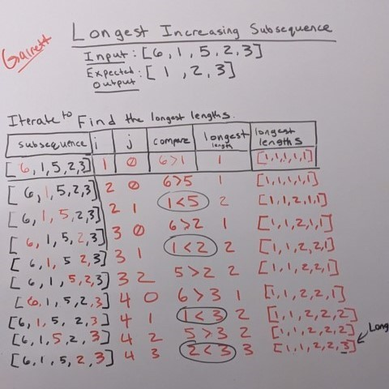

# Find Longest Subsequence

Given a sequence of integers, find the longest increasing subsequence.

[Click to: Navigate to Source Code](./src/LongestSubsequence.py)

[Click to: Run Solution in Browser](https://replit.com/@gmoorecode/Python#main.py)

# Table of Contents

- [Run Locally](#run-locally)
- [Approach](#approach)
- [Coding Logic](#coding-logic)
- [Complexity Analysis](#complexity-analysis)

## Run Locally

### Requirements

- [Python](https://www.python.org/downloads/) >= 3.8
- [git](https://git-scm.com/downloads)

### Installation

Clone the repository from GitHub by opening Terminal and running the following command:

```commandline
git clone https://github.com/garrettmmoore/longest-subsequence.git
```

### Run Tests

Open [Terminal](https://learn.microsoft.com/en-us/windows/terminal/install) or Command Prompt and navigate to the root of the project directory to run
the following command:

```python
python -m unittest ./tests/test_longest_subsequence.py
```

## Approach

Use dynamic programming to break down the main problem into sub-problems.

The main problem is to find the length of a given subsequence where the elements of 
the subsequence are in increasing order.

This can be broken down into the following sub-problems:

- For every index in the sequence up to the current index, find and store the longest increasing 
subsequence in that subsequence. At the same time, store the previous index that corresponds to the
current longest subsequence.



- Identify the longest increasing length out of all the subsequences.
- Build the longest increasing subsequence by iterating over the previous indices.

## Coding Logic
    
Initialize the length of the longest increasing subsequence for
each element to 1.

```python
seq_size = len(seq)
longest_lengths = [1] * seq_size
```
    
Initialize a list to store the longest subsequence with placeholder
values.

```python
prev_indices = [0] * seq_size
```
Iterate through the input sequence.

- For each element, compare it with all the previous elements.

  - If the current element is greater than the previous element and the
  length of the longest subsequence at the current element is less than 
  the length of the longest subsequence at the previous element plus 1, 
  update the length of the longest subsequence at the current element 
  and the element in the longest subsequence list.

```python
for i in range(seq_size):
    for j in range(i):
        if seq[i] > seq[j] and longest_lengths[j] + 1 > longest_lengths[i]:
            longest_lengths[i] = longest_lengths[j] + 1
            prev_indices[i] = j
```

Identify the end of the longest subsequence by finding the index of the subsequence
with the longest length.

```python
longest_index = longest_lengths.index(max(longest_lengths))
```

Identify the length of the longest increasing subsequence.
```python
longest_length = longest_lengths[longest_index]
```

Initialize a list to store the longest increasing subsequence result.

```python
longest_subseq = [0] * longest_length
```

Build the longest subsequence by starting from the end of the
longest subsequence and adding elements to the subsequence until its
length becomes equal to the maximum length.

```python
# Build the longest increasing subsequence list
for i in reversed(range(longest_length)):
    longest_subseq[i] = seq[longest_index]
    longest_index = prev_indices[longest_index]
```

Return the longest subsequence.
```python
 return longest_subseq
```

## Complexity Analysis

### Time Complexity

The time complexity of this method is `O(n^2)`, where n is the length of
the input sequence. The outer loop is `O(n)` the nested inner loop is 
`O(n)`. Therefore, `O(n) * O(n) = O(n^2)`.

### Space Complexity
The space complexity of this method is `O(n)`, where n is the length of 
the input sequence.